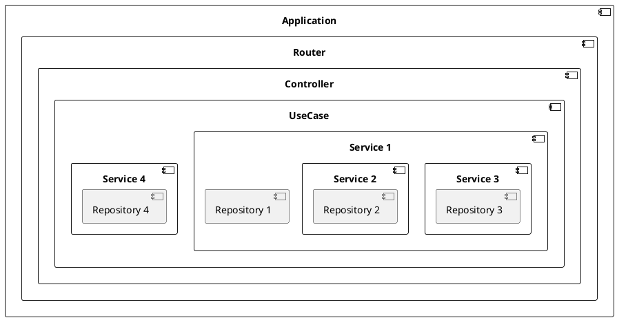
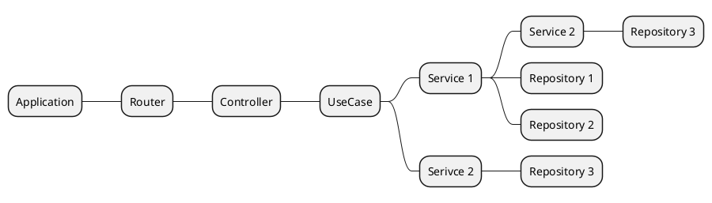

# Архитектура бэкенд приложений на платформе Python

Python является высокоуровневым языком программирования с простой и понятной синтаксической структурой, что значительно ускоряет процесс разработки и облегчает поддержку кода. Его читаемость и лаконичность позволяют командам разработчиков быстро вводить новые функции и исправлять ошибки без потери качества. Это особенно важно при создании архитектуры сложных систем, где ясность и поддерживаемость кода имеют первостепенное значение.

## Инструментарий

В качестве пакетных менеджеров используются два основных:

1. [uv](https://docs.astral.sh/uv/) - рекомендуемый
2. [poetry](https://python-poetry.org) - счиатется устаревшим и не рекомендуется к использованию

Стандартный менеджер пакетных зависимостей [pip](https://pip.pypa.io/) используется в случаях,
когда проект является точечным, "одноразовым" и не планирется к развитию
после окончания разработки.

Основной инструментарий для разработки бэкенд сервисов можно разделить на два
условных раздела: для непосредственной работы приложения, а также для помощи в разработке.
Прежде, чем приступать к разработке необходимо ознакомиться с основным инструментарием, который представлен ниже:

1. Основные инструменты для использования при реализации сервисов:
   - [FastAPI](https://fastapi.tiangolo.com)
   - [Pydantic](https://docs.pydantic.dev/latest/)
   - [SqlAlchemy](https://www.sqlalchemy.org)
   - [Alembic](https://alembic.sqlalchemy.org/en/latest/)
   - [Httpx](https://www.python-httpx.org)
   - [Python-Jwt](https://pyjwt.readthedocs.io/en/stable/)
   - [Prefect](https://www.prefect.io)
   - [FastStream](https://faststream.airt.ai/latest)
   - [uvicorn](https://www.uvicorn.org)
   - [apscheduler](https://github.com/agronholm/apscheduler)
   - [uv](https://docs.astral.sh/uv/)
2. Вспомогательные инструменты для разработки:
   - [pytest](https://docs.pytest.org/en/stable/)
   - [ruff](https://github.com/astral-sh/ruff)
   - [mypy](https://www.mypy-lang.org)
   - [pre-commit](https://pre-commit.com)
   - [black](https://black.readthedocs.io/en/stable/)
   - [ipykernel](https://ipython.readthedocs.io/en/)

## Типовая структура сервисов

Ниже представлена типовая структура сервисов, а также описание дирректорий и файлов. Выход за пределы структуры позволяется только с разрешения
техлида или лидера компетенций соответствующего направления, а также лидера разработки.

```
📁 {{ project name }}           // Название проекта
| 📁 .vscode                    // Конфигурации vscode
| |- tasks.json                 // Файл с командами для расширения TaskExprorer
| |- launch.json                // Файл с командами для запуска сервиса с дебаггером
| |- settings.json              // Файл конфигурации редактора vscode
| 📁 migrations                 // Файл с миграциями базы данных alembic
| | 📁 versions
| | | 2024_09_11_comment.py     // Файл с миграцией базы данных
| | __init__.py
| | env.py                      // Настройки окружения для генерации и накатывания миграций
| | script.py.mako              // Шаблон для генерации миграций
| | utils.py                    // Вспомогательные утилиты для генерации миграций
| 📁 {{ service name }}         // Название сервиса, например: portal, users, processing ...
| | 📁 apps
| | | 📁 healthcheck            // Приложение для проверки healthcheck
| | | | __init__.py             // Испорты модуля healthcheck
| | | | router.py               // Роуты приложения healthcheck
| | | | schemas.py              // DTO схемы приложения healthcheck
| | | 📁 users                  // Приложение пользователей
| | | | 📁 repositories         // Слой репозиториев приложения users
| | | | | __init__.py           // Экспорты репозитория пользователей
| | | | | users.py              // Репозиторий пользователей
| | | | | company.py            // Репозиторий компаний
| | | | 📁 services             // Сервисный слой приложения users
| | | | | __init__.py           // Экспорты сервисного слоя приложения users
| | | | | users.py              // Сервис пользователей
| | | | | company.py            // Сервис компаний
| | | | 📁 use_cases            // Слой UseCase (UserStory)
| | | | | __init__.py           // Экспорты UseCases
| | | | | user_list.py          // Получение списка пользователей
| | | | | create_user.py        // Создание пользователя
| | | | | update_user.py        // Обновление пользователя
| | | | | delete_user.py        // Удаление пользователя
| | | | 📁 schemas              // Схемы проекта
| | | | | __init__.py           // Экспорт схем приложения users
| | | | | users.py              // Схемы пользователей
| | | | | company.py            // Схемы компаний
| | | | __init__.py
| | | | depends.py              // Построение IoC контейнера
| | | | enums.py                // Константы перечислений
| | | | models.py               // Модели схемы базы данных приложения users
| | | | serializers.py          // Правила и механизм сериализации объектов
| | | | router.py               // Роутер и контроллеры
| | | | exceptions.py           // Исключения, наследуемые от core/exceptions
| | | 📁 other...               // Другие приложения в сервисе
| | 📁 certs                    // Сертификаты для локальной разработки
| | | 📁 elasticsearh           // Сертификаты для elastic search
| | | | ca.pem                  // Корневой сертификт
| | | 📁 kafka                  // Серитфикаты для kafka
| | | | ca.pem                  // Корневой сертификат
| | | | cert.pem                // Сертификат пользователя
| | | | key.crt                 // Ключ
| | 📁 core                     // Сервисы и утилиты общего назначения
| | | 📁 repositories           // Репозитории общего назнаечния
| | | | __init__.py             // Экспорт репозиториев и протоколов
| | | | base_repository.py      // Базовый CRUD репозиторий доступа к БД
| | | | 📁 cache_repository     // Базовый репозиторий кеширования
| | | | | __init__.py           // Модуль, содержащий описание интерфейсов
| | | | | inmemory.py           // Имплементация inmemory кеширования
| | | | | redis.py              // Имплементация на основе Redis
| | | 📁 services               // Сервисы общего назначения
| | | | __init__.py             // Экспорт сервисов и протоколов
| | | | transaction.py          // Сервис организации транзакций
| | | __init__.py
| | | db.py                     // Настройки подключения к базе данных
| | | depends.py                // Построение IoC контейнера
| | | enums.py                  // Список Enums
| | | exceptions.py             // Набор общих исключений
| | | loggers.py                // Настройки логгера
| | | models.py                 // Миксины моделей схем баз данных
| | | schemas.py                // Общие схемы (DTO)
| | | use_cases.py              // Общие элементы UseCases
| | 📁 tools                    // Cli утилиты
| | | 📁 core                   // Модуль общих команд
| | | | __init__.py             // Модель общих команд
| | | | cryptography.py         // Команда cryptography
| | | app.py                    // Точка входа в cli приложение
| | | utils.py                  // Утилиты cli приложения
| | __init__.py
| | bootstrap.py                // Файл сборки приложения
| | exceptions.py               // Файл с набором обработчиков исключений
| | main.py                     // Точка входа в приложение
| | middleware.py               // Добавление сервисных прослоек
| | router.py                   // root роутер приложения
| | settings.py                 // Файл с набором конфигураций приложения
| | swagger.py                  // Файл для доп настрйоки свагера
| 📁 seed                       // Пресеты данных для заполнения в СУБД
| | 001.users.json              // Заготовка пользователей
| | 002.groups.json             // Группы пользователей
| 📁 tests                      // Unit тесты сервиса
| | 📁 apps                     // Набор приложений
| | | 📁 healthcheck            // Тесты для приложения healthcheck
| | | | conftest.py             // Фикстуры, относящиеся к приложению healthcheck
| | | | test_router.py          // Тесты роута
| | | | test_repositories.py    // Тесты слоя репозиториев
| | | | test_services.py        // Тесты сервисного слоя
| | conftest.py                 // Файл, содержащий фикстуры всего проекта
| .dockerignore                 // Игнорирование при сборке докер образов
| .env.example                  // Пример файла .env
| .gitignore                    // Игнорирование git
| .isort.cfg                    // Параметры сортировки импортов
| .logging.dev.yaml             // Параметры логгирования при локальной разработки
| .logging.yaml                 // Параметры логгирования в прод окружении
| .pre-commit-config.yaml       // Конфигурация прекоммит файлов
| .python-version               // Версия python, для pyenv
| .alembic.ini                  // Конфигцрационный файл для alembic
| .docker-compose.yaml          // Файл инфраструктуры для изолированной разработки
| Dockerfile                    // Файл описания Docker контейнера
| entrypoint.sh                 // Docker entrypoint
| Makefile                      // Файл вспомогательных команд
| manage.py                     // Точка входа для cli утилит
| poetry.lock                   // Устанавливаемые зависимости и их версии
| pyproject.toml                // Файл конфигурации проекта
| pytest.ini                    // Конфигурация unit-тестов
| README.md                     // Описание проекта и предметной области
```

В связи с представленной структурой проекта можно вывести правила названия файлов, а также содержащих их классов и других сущностей

1. Репозитории

Репозитории находятся в модуле `repositories` и имеют названия файлов без префиксов, например

```
📁 repositories
| __init__.py
| users.py // Репозиторий пользователя
```

Внутри файла users.py лежит файл протокола

- `UsersRepositoryProtocol` - описание протокола репозитория пользователя
- `UsersRepositoryImpl` - описание имплементации репозитория пользователей
- `UsersFactoryRepositoryProtocol` - описание фабрики пользователей, к примеру, если пользователи лежат в разных местах
- `UsersFactoryRepositoryImpl` - имплементация абстрактной фабрики пользователей
  В некоторых случаях, можно указывать имплементацию без Impl, например:
- `SearchRepositoryProtocol` - протокол поискогово движка
- `ElasticSearchRepository` - имплементация ElasticSearch
- `OpenSearchRepository` - имплементация OpenSearch

Примеры реализации различных сервисов представлены тут:

- [FastAPI boilerplate](https://github.com)

## Запуск приложения в режиме разработки

```bash
git clone ...           # Клонируем репозиторий
cp .env.example .env    # Создаем .env
# Если собественный registry
poetry config certificates.osc.cert false   # Отключаем проверку сертификатов
poetry config http-basic.osc token "$TOKEN" # Устанавливаем токен на source OSC
PYTHONWARNINGS="ignore:Unverified HTTPS request" poetry install --no-root # Устанавливаем записимости

# Запускаем приложение
poetry run uvicorn {{ service name }}.main:app --reload --host 0.0.0.0 --port 8000
```

## Принципы Solid

Ключевые аспекты репозитория в чистой архитектуре:

- **Абстракция данных:** Репозиторий предоставляет интерфейс, который определяет, какие операции с данными возможны (например, получить пользователя по ID, сохранить заказ и т.д.), без указания, как именно эти операции реализованы.
- **Инверсия зависимостей:** Вместо того чтобы высокоуровневые модули зависели от низкоуровневых деталей реализации (например, от конкретной базы данных), репозитории позволяют модулям бизнес-логики зависеть от абстракций. Это достигается с помощью внедрения зависимостей и интерфейсов.
- **Тестируемость:** Благодаря абстрагированию доступа к данным, становится проще писать модульные тесты для бизнес-логики, заменяя реальные репозитории мок-объектами или заглушками.
- **Гибкость и расширяемость:** Изменение способа хранения данных (например, переход с одной базы данных на другую) не требует изменений в бизнес-логике приложения, так как взаимодействие происходит через стабильный интерфейс репозитория.

**SOLID** - аббривиатура набора принципов разработки,

- **S** — принцип единственной ответственности (_Single Responsibility Principle_).
  Каждый класс или модуль должен иметь одну и только одну причину для изменения, то есть отвечать за выполнение лишь одной определённой функциональности.

Пример нарушения правила:

```python
class Report:
    def calculate_statistics(self, data):
        # код для вычисления статистики
        ...

    def format_report(self, statistics):
        # код для форматирования отчёта
        ...

    def print_report(self, formatted_report):
        # код для вывода отчёта на печать
        ...
```

Здесь класс Report отвечает за несколько задач: вычисление статистики, форматирование и печать отчёта. Представим пример исправленного сниппета кода:

```python
class StatisticsCalculator:
    def calculate(self, data):
        # код для вычисления статистики
        ...

class ReportFormatter:
    def format(self, statistics):
        # код для форматирования отчёта
        ...

class ReportPrinter:
    def print(self, formatted_report):
        # код для вывода отчёта на печать
        ...
```

- **O** — принцип открытости/закрытости (_Open/Closed Principle_).
  Программные сущности должны быть открыты для расширения, но закрыты для изменения.

Пример нарушение правила:

```python
class PaymentProcessor:
    def process_payment(self, payment_method, amount):
        if payment_method == 'credit_card':
            # обработка оплаты кредитной картой
            ...
        elif payment_method == 'paypal':
            # обработка оплаты через PayPal
            ...
```

Представим пример исправленного сниппета кода:

```python
from abc import ABC, abstractmethod

class PaymentMethod(ABC):
    @abstractmethod
    def pay(self, amount):
        ...

class CreditCardPayment(PaymentMethod):
    def pay(self, amount):
        # обработка оплаты кредитной картой
        ...

class PayPalPayment(PaymentMethod):
    def pay(self, amount):
        # обработка оплаты через PayPal
        ...

class PaymentProcessor:
    def process_payment(self, payment_method: PaymentMethod, amount):
        payment_method.pay(amount)
```

Теперь, чтобы добавить новый способ оплаты, достаточно создать новый класс, реализующий интерфейс PaymentMethod, без изменения существующего кода.

- **L** — Принцип подстановки Лисков (_Liskov Substitution Principle_).
  Объекты должны быть заменяемы экземплярами их подтипов без нарушения корректности работы программы.

Пример нарушение правила:

```python
class Rectangle:
    def __init__(self, width, height):
        self.width = width
        self.height = height

    def area(self):
        return self.width * self.height

class Square(Rectangle):
    def __init__(self, size):
        super().__init__(size, size)

    def set_width(self, width):
        self.width = width
        self.height = width

    def set_height(self, height):
        self.width = height
        self.height = height
```

Использование класса Square вместо Rectangle может привести к неожиданному поведению.
Представим пример исправленного сниппета кода:

```python
class Shape(ABC):
    @abstractmethod
    def area(self):
        ...

class Rectangle(Shape):
    def __init__(self, width, height):
        self.width = width
        self.height = height

    def area(self):
        return self.width * self.height

class Square(Shape):
    def __init__(self, size):
        self.size = size

    def area(self):
        return self.size * self.size
```

- **I** — Принцип разделения интерфейса (_Interface Segregation Principle_).
  Не следует заставлять клиентов зависеть от интерфейсов, которые они не используют.

Пример нарушение правила:

```python
class MultiFunctionDevice(ABC):
    @abstractmethod
    def print(self, document):
        ...

    @abstractmethod
    def scan(self, document):
        ...

    @abstractmethod
    def fax(self, document):
        ...

class OldPrinter(MultiFunctionDevice):
    def print(self, document):
        # печать документа
        ...

    def scan(self, document):
        ...  # не поддерживается

    def fax(self, document):
        ...  # не поддерживается

```

Класс `OldPrinter` вынужден реализовывать методы, которые не использует.
Представим пример исправленного сниппета кода:

```python
class Printer(ABC):
    @abstractmethod
    def print(self, document):
        ...

class Scanner(ABC):
    @abstractmethod
    def scan(self, document):
        ...

class Fax(ABC):
    @abstractmethod
    def fax(self, document):
        ...

class OldPrinter(Printer):
    def print(self, document):
        # печать документа
        ...

class MultiFunctionPrinter(Printer, Scanner, Fax):
    def print(self, document):
        ...

    def scan(self, document):
        ...

    def fax(self, document):
        ...

```

- **D** — Принцип инверсии зависимостей (_Dependency Inversion Principle_).
  Модули верхнего уровня не должны зависеть от модулей нижнего уровня; оба должны зависеть от абстракций.

Пример нарушение правила:

```python
class MySQLDatabase:
    def connect(self):
        # код для подключения к базе данных MySQL
        pass

class DataAccess:
    def __init__(self):
        self.database = MySQLDatabase()

    def get_data(self):
        self.database.connect()
        # получение данных
```

Класс `DataAccess` зависит от конкретной реализации `MySQLDatabase`.
Представим пример исправленного сниппета кода:

```python
class Database(ABC):
    @abstractmethod
    def connect(self):
        ...

class MySQLDatabase(Database):
    def connect(self):
        # код для подключения к базе данных MySQL
        ...

class PostgreSQLDatabase(Database):
    def connect(self):
        # код для подключения к базе данных PostgreSQL
        ...

class DataAccess:
    def __init__(self, database: Database):
        self.database = database

    def get_data(self):
        self.database.connect()
        # получение данных
```

Применение принципов `SOLID` способствует созданию устойчивой, масштабируемой и легко поддерживаемой программной системы, что особенно важно в условиях динамично меняющихся требований и технологий.

## Чистая архитектура

### Зависимость от абстракции, а не от реализации

В качестве примера рассмотрим репозиторий. В качестве репозитория выступает сущность,
которая управляет источником данных, например:

- СУБД Postges
- ClickHouse
- Rest
- gRPC
- ...другие способы взаимодейтсвия с источниками данных.

В качестве примера рассмотрим репозитория сервиса, который запрашивает пользователя из другого сервиса:

```python
from contextlib import asynccontextmanager
from typing import AsyncIterator, Protocol, Self

import httpx
from fastapi import Request, Response

from portal.settings import Settings

from ..schemas import UserSchema


class UsersRepositoryProtocol(Protocol):
    """
    Протокол репозитория для взаимодействия с сервисом пользователей.
    """

    async def get_me(self: Self) -> UserSchema | None:
        """
        Получаем текущего пользователя.
        """
        ...


class UsersRepositoryImpl:
    """
    Реализация репозитория для взаимодействия с сервисом voiceai-users.
    """

    def __init__(self, settings: Settings, request: Request, response: Response) -> None:
        self.settings = settings
        self.request = request
        self.response = response

    async def get_me(self: Self) -> UserSchema | None:
        """
        Получаем текущего пользователя.
        """
        async with self.use_client() as client:
            response = await client.get(f'{self.settings.users_url}/me', cookies=self.request.cookies)
            if response.is_success:
                return UserSchema.model_validate(response.json())

    @asynccontextmanager
    async def use_client(self: Self) -> AsyncIterator[httpx.AsyncClient]:
        """
        Создаем клиент.
        """
        http_client = httpx.AsyncClient()
        try:
            yield http_client
        finally:
            await http_client.aclose()
```

Как можно видеть имеются две основных сущности.

1. `UsersRepositoryProtocol` - протокол репозитория, наследуется от `Protocol` - структурная типизация.
2. `UsersRepositoryImpl` - конкретная имплементация, реализующая протокол `UsersRepositoryProtocol`.

При этом, при использовании имплементации мы всегда отталкиваемся от контракта, описанного в протоколе.

Репозитории находятся в папке `repository`, соответственно, содержащий файл `users.py`, как представлено
выше в структуре проекта.

```
📁 repository
| __init__.py
| users.py // Файл репозитория пользователей
```

### Абстрактная фабрика

В некоторых случаях могут быть представлены разные реализации одного контракта (протокола/интерфейса).
Исходя из описаний чистой архитектуры, необходимо делать абстрактную фабрику и внедрять уже ее.
Рассмотрим пример `storage` приложения. Кеш может быть имплементрирован двумя или более способами.
Рассмотрим в качестве примера две имплементации: локальное хранилище и S3 хранилище.
Пример описания абстрактной фабрики представлен ниже:

```python
from pathlib import Path
from typing import Annotated, AsyncContextManager, Protocol, Self, overload

from fastapi import Depends

from portal.core.enums import StorageEnum

from .local_storage import LocalStorage
from .reader import StreamReader as StreamReader
from .reader import StreamReaderProtocol
from .s3_storage import S3Storage
from .schemas import LocalStorageParamsSchema, S3StorageParamsSchema


# Описание протокола
class StorageRepositoryProtocol(Protocol):
    async def exists(self, name: str | Path) -> bool:
        """
        Проверка существования файла.
        """
        ...

    async def listdir(self, name: str | Path) -> list[str]:
        """
        Список файлов и директорий в заданной директории.
        """
        ...

    async def is_file(self, name: str | Path) -> bool:
        """
        Возвращает True, если путь существует и это файл.
        """
        ...

# Описание протокола абстрактной фабрики для создания сервисов хранения файлов
class StorageFactoryRepositoryProtocol(Protocol):
    @overload
    async def make(self: Self, kind: StorageEnum, params: S3StorageParamsSchema) -> StorageProtocol:
        """Создаем S3 файловый репозиторий."""
        ...

    @overload
    async def make(self: Self, kind: StorageEnum, params: LocalStorageParamsSchema) -> StorageProtocol:
        """Создаем локальный файловый репозиторий."""
        ...

    async def make(self, kind: StorageEnum, params: StorageParamsSchema) -> StorageProtocol:
        ...

# Имплементация фабрики
class StorageFactoryRepositoryImpl:
    @overload
    async def make(self: Self, kind: StorageEnum, params: S3StorageParamsSchema) -> StorageProtocol:
        ...

    @overload
    async def make(self: Self, kind: StorageEnum, params: LocalStorageParamsSchema) -> StorageProtocol:
        ...

    async def make(self: Self, kind: StorageEnum, params: StorageParamsSchema) -> StorageProtocol:
        if kind == StorageEnum.S3 and isinstance(params, S3StorageParamsSchema):
            return await self.make_s3_storage(params)
        elif kind == StorageEnum.LOCAL and isinstance(params, LocalStorageParamsSchema):
            return await self.make_local_storage(params)
        raise NotImplementedError

    async def make_s3_storage(self: Self, params: S3StorageParamsSchema) -> StorageProtocol:
        return S3Storage(params)

    async def make_local_storage(self: Self, params: LocalStorageParamsSchema) -> StorageProtocol:
        return LocalStorage(params)
```

Рассмотрим пример реализации представленных имплементаций.
Пример реализации локального хранилища представлен ниже:

```python
"""Local Storage."""
from __future__ import annotations

import asyncio
import os
from contextlib import asynccontextmanager
from logging import getLogger
from pathlib import Path
from typing import TYPE_CHECKING, AsyncGenerator, cast

from aiofiles import open
from aiofiles import os as aos

from .schemas import LocalStorageParamsSchema


class LocalStorage:
    def __init__(self, params: LocalStorageParamsSchema):
        self.work_dir = Path(params.path)
        if not os.path.exists(self.work_dir):
            os.makedirs(self.work_dir)
        self.logger = getLogger(__name__)

    async def exists(self, name: str | Path) -> bool:
        path = self.work_dir / name
        return await aos.path.exists(path)

    async def listdir(self, name: str | Path | None = None) -> list[str]:
        path = self.work_dir
        if name:
            path = path / name
        return await aos.listdir(path)

    async def is_file(self, name: str | Path) -> bool:
        path = self.work_dir / name
        return await aos.path.isfile(path)
```

Реализация имплементации _S3_ хранилища представлена ниже. В качестве провайдера используется
библиотека _miniopy_async_.

```python
"""S3 Storage."""
from __future__ import annotations

import io
from contextlib import asynccontextmanager
from pathlib import Path
from typing import TYPE_CHECKING, AsyncGenerator

import aiohttp
import miniopy_async
from miniopy_async.error import S3Error

from .schemas import S3StorageParamsSchema


class S3Storage:
    def __init__(self, params: S3StorageParamsSchema):
        self.params = params
        self.client = miniopy_async.Minio(
            f'{self.params.endpoint}:{self.params.port}',
            access_key=self.params.access_key,
            secret_key=self.params.secret_key,
            secure=self.params.secure,
        )

    async def listdir(self, name: str | Path) -> list[str]:
        directory: str = str(name) if isinstance(name, Path) else name
        if directory and directory[-1] != '/':
            directory += '/'
        objects = await self.client.list_objects(self.bucket, prefix=directory)
        return [str(obj.object_name) for obj in objects] if objects else []

    async def is_file(self, name: str | Path) -> bool:
        return not await self.is_dir(name)
```

Сервисы оформляются также как и репозитории, однако объединяют и инжектят другие сервисы и репозитории.

## UseCase

В файле `{{ service name }}/core/use_cases.py` лежит общий для сервиса протокол,
котовый выглядит следующим образом:

```python
from typing import Protocol, TypeVar

UseCaseResultSchemaType = TypeVar('UseCaseResultSchemaType', covariant=True)


class UseCaseProtocol(Protocol[UseCaseResultSchemaType]):
    """
    Протокол варианта использования.
    """

    async def __call__(self) -> UseCaseResultSchemaType:
        """
        Вызываем вариант использования.
        """
        ...

```

При этом, протокол получения пользователя может выглядить следующим образом:

```python
from typing import Protocol, Self

from ..schemas import UserResponseSchema, UserSchema


class MeUseCaseProtocol(Protocol):
    """
    Протокол варианта использования для получения текущего пользователя.
    """

    async def get_me(self: Self) -> UserResponseSchema:
        """
        Получаем текущего пользователя.
        """
        ...


class MeUseCaseImpl:
    """
    Реализация варианта использования для получения текущего пользователя.
    """

    def __init__(self, user: UserSchema) -> None:
        self.user = user

    async def get_me(self: Self) -> UserResponseSchema:
        """
        Получаем текущего пользователя.
        """
        return UserResponseSchema.model_validate(self.user, from_attributes=True)

```

На каждый `EndPoint` формируется ровно единственный `UseCase`.

## API Request и Response схемы

Все API схемы для описания входящих запросов должны быть описаны с помощью `Pydantic`
и должны быть отнаследованы от `RequestSchema`, которая показана ниже.
Однако, исходящие запросы должны приводиться к нотации `camelCase`, описываться с помощью `Pydantic`
моделей и наследоваться от `ResponseSchema`.

```python
from __future__ import annotations

import uuid
from typing import Generic, Self, TypeVar

from pydantic import AliasGenerator, BaseModel, ConfigDict, field_validator
from pydantic.alias_generators import to_camel

class RequestSchema(BaseModel):
    """
    Схема запроса.
    """
    # Настройка добавления алиасов и валидирования из camelCase -> snake_case
    model_config = ConfigDict(
        alias_generator=AliasGenerator(
            validation_alias=to_camel,
        )
    )

class ResponseSchema(BaseModel):
    """
    Схема ответа.
    """

    # Настройка генерирования в camelCase из snake_case -> camelCase
    model_config = ConfigDict(
        alias_generator=AliasGenerator(
            serialization_alias=to_camel,
        )
    )

RemoteResponseSchema = RequestSchema
RemoteRequestSchema = ResponseSchema
```

Межсервисное взаимодействие должно обеспечиваться с помощью этих же трансформаций,
в следствие чего должны использоваться классы `RemoteResponseSchema` и `RemoteRequestSchema`.

## Транзакции

**Транзакция** — это единица работы с базой данных, состоящая из одного или нескольких операций _SQL_, которые выполняются как одно целое. Транзакции обладают свойствами, известными как _ACID_:

- **Atomicity (Атомарность):** Все операции внутри транзакции выполняются полностью или не выполняются вовсе. Если происходит ошибка, все изменения откатываются.
- **Consistency (Согласованность):** Транзакции переводят базу данных из одного согласованного состояния в другое, соблюдая все ограничения целостности.
- **Isolation (Изоляция):** Одновременные транзакции не влияют друг на друга, обеспечивая изолированность выполнения.
- **Durability (Долговечность):** После фиксации транзакции ее результаты сохраняются даже в случае сбоев системы.

Типичный код репозитория к базе данных на любой запрос открывает транзакцию. В случае,
если транзакция явно не открывается - она все равно открывается внутренностями _SqlAlchemy_.

```python
import uuid
import sqlalchemy as sa
from typing import Protocol, Self

from portal.core.db import SessionManagerProtocol

from ..models import check_list_mark_template


class TodoRepositoryProtocol(Protocol):
    """
    Протокол репозитория для работы со списком выбранного todo листа.
    """

    async def set_active(self: Self, todo_id: uuid.UUID, status: bool) -> None:
        """
        Устанавливаем шаблоны оценки чек-листа.
        """
        ...


class CheckListMarkTemplatesRepositoryImpl:
    """
    Реализация репозитория для работы со списком выбранного todo листа.
    """

    def __init__(self, session_manager: SessionManagerProtocol) -> None:
        self.session_manager = session_manager

    async def set_active(self: Self, todo_id: uuid.UUID, status: bool) -> None:
        """
        Устанавливаем шаблоны оценки чек-листа.
        """
        async with self.session_manager.get_session() as s:
            statement = (
                sa.update(self.model_type)
                .where(self.model_type.id == pk)
                .values({'status': status})
                .returning(self.model_type)
            )
            await s.execute(statement)
        # Мы все еще находимся в транзакции и она открыта.
```

В виду того, что мы находимся в транзации в момент, когда сессия в _SqlAlchemy_ завершается,
поэтому над стандартной сессии пишется обертка, которая в случае, если мы находимся внутри
транзакции, создается вложенная транзакция, которая открывается на основе, т.е.
по сути вызывается `SAVEPOINT` внутри транзакции.
Код сервиса представлен ниже:

```python
from contextlib import asynccontextmanager
from typing import AsyncContextManager, AsyncIterator, Protocol, Self

import sqlalchemy as sa
from sqlalchemy.ext.asyncio import AsyncSession


class TransactionServiceProtocol(Protocol):
    """
    Протокол сервиса транзакций.
    """

    def begin(self: Self, immediate: bool = True) -> AsyncContextManager[None]:
        """
        Начинаем транзакцию.
        """
        ...


class TransactionServiceImpl:
    """
    Реализация сервиса транзакций.
    """

    def __init__(self, session: AsyncSession) -> None:
        self.session = session

    @asynccontextmanager
    async def begin(self: Self, immediate: bool = True) -> AsyncIterator[None]:
        """
        Начинаем транзакцию.
        """
        async with self.session.begin():
            if immediate:
                await self.session.execute(sa.text('SET CONSTRAINTS ALL IMMEDIATE'))
            yield
```

Если несколько репозиториев нужно объединить в одну транзакцию, то стартовать транзакцию необходимо в
в сервисе транзакций:

```python


class TodoUseCase(UseCase[ResponseModel]):

    def __init__(
        self,
        transaction_service: TransactionServiceProtocol,
        service1: Service1Protocol,
        service2: Service2Protocol
    ) -> None:
        self.transaction_service = transaction_service
        self.service1 = Service1Protocol
        self.service2 = Service2Protocol

    def __call__(self) -> ResponseModel:
        async with self.transaction_service.begin():
            # Выполнения запросов service1 и service2 происходит внутри одной транзакции
            service1.do_smt()
            service2.do_smt()
```

## Depends и IoC контейнер

**_Inversion of Control (IoC)_** и **_Dependency Injection (DI)_** — это важные концепции в разработке программного обеспечения, направленные на улучшение модульности, повторного использования кода и тестируемости приложений. _FastAPI_, современный веб-фреймворк для _Python_, активно использует эти принципы, предоставляя разработчикам простой и эффективный способ управления зависимостями.

_FastAPI_ встроенно поддерживает _Dependency Injection_, предоставляя механизм для декларативного определения зависимостей с помощью функции Depends.

Как работает _DI_ в _FastAPI_:

- **Функция-зависимость:** Вы определяете функцию, которая содержит логику зависимости (например, получение пользователя из базы данных, проверка токена).
- **Использование Depends:** В обработчике маршрута вы указываете зависимость через параметр с типом Depends(ваша*функция*зависимость).
- **FastAPI управляет жизненным циклом зависимостей:** Фреймворк вызывает функции-зависимости, кеширует результаты при необходимости и передает их в обработчик.

В представлении фреймворка построенный IoC является той частью, которая является разделением
между конкретной имплементацией фреймворка и бизнес логикой приложения.
Для реализации этого перехода в каждом приложении располагается файл `depends.py`.
Пример реализации файла представлен ниже:

```python
from fastapi import Depends
from .repositories import TodoRepositoryProtocol, TodoRepositoryImpl
from .services import TodoServiceProtocol, TodoServiceImpl
from .use_cases import TodoUseCaseProtocol, TodoUseCaseImpl

# --- repositories ---

def get_todo_repository(
    session_manager: SessionManager,
) -> TodoRepositoryProtocol:
    return TodoRepositoryImpl(session_manager)

TodoRepository = Annotated[TodoRepositoryProtocol, Depends(get_todo_repository)]

# --- services ---

def get_todo_services(
    todo_repository: TodoRepository,
) -> TodoServiceProtocol:
    return TodoServiceImpl(todo_repository)

TodoService = Annotated[TodoServiceProtocol, Depends(get_todo_services)]

# --- use_cases ---

def get_todo_use_case(
    todo_service: TodoService
) -> TodoUseCaseProtocol:
    return TodoUseCaseImpl(todo_service)
```

## Sync и Async функции

В современных приложениях на Python, особенно при использовании асинхронного программирования с asyncio, часто возникает необходимость выполнять синхронные (блокирующие) функции в асинхронной среде. Чтобы избежать блокировки основного асинхронного потока выполнения, синхронные функции можно запускать в отдельном пуле потоков (_thread pool_) или процессов (_process pool_).

_ThreadPoolExecutor_ подходит для выполнения блокирующих I/O операций, то есть когда функция ожидает ввода-вывода, например:

- Сетевые запросы к _API_ без асинхронных библиотек.
- Чтение и запись файлов на диск.
- Обращение к базам данных без поддержки асинхронности.

Причины использовать _ThreadPoolExecutor_ для _I/O-bound_ задач:

- _GIL (Global Interpreter Lock):_ В Python интерпретатор CPython имеет GIL, который не позволяет нескольким потокам выполнять байт-код одновременно. Однако при I/O операциях потоки освобождают GIL, позволяя другим потокам продолжить выполнение.
- _Низкие накладные расходы:_ Создание и переключение между потоками дешевле, чем между процессами.
- _Простота обмена данными:_ Потоки разделяют общую память, что упрощает передачу данных между ними.

В связи с этим синхронные функции не оборачиваем в async.
Оборачивание синхронных функциой добавляет некоторые накладные расходы на формирование Future,
которая по сути ничего не ожидает.

```python
# ✅ correct
def get_todo_repositories() -> TodoRepositoryProtocol:
    return TodoRepositoryImpl()

# ❌ incorrect
async def get_todo_repositories() -> TodoRepositoryProtocol:
    return TodoRepositoryImpl()
```

Синхронные функции в асинхронной среде запускаются в соответствующих функциях для запуска `run_in_processpool` и
`run_in_threadpool`:

```python
# run_in_processpool.py

import asyncio
import multiprocessing as mp
from concurrent.futures import ProcessPoolExecutor
from functools import partial
from typing import Callable, TypeVar

from typing_extensions import ParamSpec

P = ParamSpec('P')
R = TypeVar('R')


async def run_in_processpool(fn: Callable[P, R], *args: P.args, **kwargs: P.kwargs) -> R:
    """
    Запуск функции в отдельном процессе.

    Используем fork в связи с https://github.com/python/cpython/issues/94765.
    """
    kwargs_fn = partial(fn, **kwargs)
    loop = asyncio.get_running_loop()
    with ProcessPoolExecutor(mp_context=mp.get_context('fork')) as executor:
        return await loop.run_in_executor(executor, kwargs_fn, *args)
```

```python
# run_in_threadpool.py

import asyncio
from concurrent.futures import ThreadPoolExecutor
from functools import partial
from typing import Callable, TypeVar

from typing_extensions import ParamSpec

R = TypeVar('R')
P = ParamSpec('P')


async def run_in_threadpool(fn: Callable[P, R], *args: P.args, **kwargs: P.kwargs) -> R:
    kwargs_fn = partial(fn, **kwargs)
    with ThreadPoolExecutor() as pool:
        loop = asyncio.get_running_loop()
        return await loop.run_in_executor(pool, kwargs_fn, *args)  # type: ignore
```

## Слои приложения

Если рассматривать слоистость приложения, то его можно представить следующим образом:




Роутер приложения, если рассматривать в коде, выглядит следующим образом:

```python
from fastapi import APIRouter

from .depends import MeUseCase
from .schemas import UserResponseSchema

router = APIRouter(prefix='/users', tags=['Users']) # Обозначение группы роутеров


@router.get('/current')                     # Указание конкретного роутера
async def current(                          # Контроллер, который инжектит
    me_use_case: MeUseCase                  # Инжекция UseCase
) -> UserResponseSchema:                    # Схема ответа пользователя
    """
    Получаем текущего пользователя.
    """
    return await me_use_case.get_me()       # Вызов конкретного UseCase

```

Кроме этого, возможность зон обращений можно представить следующей диаграммой:




## Литература

- [Лучшие практики FastAPI](https://github.com/zhanymkanov/fastapi-best-practices)
- [Чистая архитектура](https://www.litres.ru/book/robert-s-martin/chistaya-arhitektura-iskusstvo-razrabotki-programmnogo-obe-39113892/)
