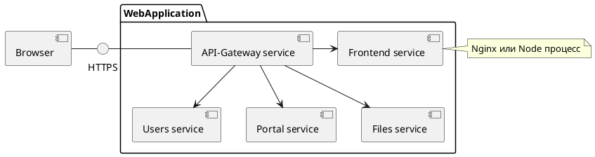

# Соглашения об именах REST API

В общем случае взаимодействие с сервером происходит через *API-Gateway*.
## API Gateway
Каждое веб-приложение содержит единую точку входа, которая реализуется с помощью *API-Gateway*. Кроме единой точки входа *API-Gateway* должен обеспечивать следующий функционал:
- маршрутизация запросов;
- ssl взаимодействие;
- проверку аутентификации пользовательских запросов;
- ограничение частоты запросов;
- сбор аналитики;
- другое.
Типичное представление [сервис-ориентированной архитектуры](https://ru.wikipedia.org/wiki/Сервис-ориентированная_архитектура) можно представить ниже:



*API-Gateway* занимается маршрутизацией, которая задается следующим образом:
```json
{
	// ... другая конфигурация сервиса API-Gateway
	"services": [
		{"name": "users", "prefix": "/api/users"},
		{"name": "portal", "prefix": "/api/portal"},
		{"name": "files", "prefix": "/api/files"},
		{"name": "frontend", "prefix": "/"},
	]
}
```
В соответствии с конфигураций *API-Gateway* о маршрутизации в путях *http* запросов перед запросом ресурсной части учитывается маршрутизация сервиса. Исключением является фронтенд, на который проксируются все запросы, не попавшие под паттерн маршрутизации сервисов.

Например:
```
GET /api/users/users // запрос списка пользователей в сервисе Users
    /api/users       // cервисная маршрутизация
              /users // запрос ресурса пользователей в сервисе Users
```

В некоторых случаях, когда присутствует версионирование запросов, оно обеспечивается после сервисной маршрутизации, однако до ресурсной маршрутизации сервиса, например:
```
GET /api/users/v1/users // запрос списка пользователей в сервисе Users
    /api/users          // cервисная маршрутизация
		      /v1       // версионировании запросов
                 /users // запрос ресурса пользователей в сервисе Users
```
В целях упрощения далее по тексту сервисный префикс и версионирование опускается и используются только ресурсные префиксы.
### Методы HTTP
Протокол [*HTTP*](https://ru.wikipedia.org/wiki/HTTP) представляет собой протокол для получения гипертекстовых страниц в формате html поверх *TCP*, однако, сейчас также используется для получения и других форматов, например, бинарных, данных формате `json` и других.
Глобально методы можно разделить на две группы: идемпотентные, которые не оставляют изменения в системе и не идемпотентные. 
В качестве методов протокола выступают глаголы, характеристики которых представлены в таблице ниже. 4 основных метода образуют аббревиатуру, которая называется *CRUD*:
- C - *create*;
- R - *read*;
- U - *update*;
- D - *delete*.

| Метод    | Описание                                                                                                            | Идемпотентный | CRUD |
| -------- | ------------------------------------------------------------------------------------------------------------------- | :-----------: | :--: |
| *GET*    | Метод `GET` запрашивает представление ресурса. Запросы с использованием этого метода могут только извлекать данные. |       ✅       |  R   |
| *POST*   | `POST` используется для создания сущностей.                                                                         |       ❌       |  C   |
| *PUT*    | `PUT` заменяет все текущие представления ресурса данными запроса.                                                   |       ✅       |  U   |
| *PATCH*  | `PATCH` используется для частичного изменения ресурса.                                                              |       ❌       |  U   |
| *DELETE* | `DELETE` удаляет указанный ресурс.                                                                                  |       ✅       |  D   |

## Ресурсы

В [REST](https://ru.wikipedia.org/wiki/REST) (*REpresentational State Transfer*) - стиль архитектурно программного взаимодействия распределенных систем, первичное представление данных которых называется ресурсом. Наличие общей стратегии к наименованию ресурсов *REST* представляется отличным дизайнерским решением на долгой дистанции. 
Ресурс может быть представлен объектом или коллекцией.
Для примера, "***users***" это пример ресурса коллекции, а "***user***" это пример ресурса объекта.
Мы можем идентифицировать коллекцию  пользователей используя [*URI*](https://en.wikipedia.org/wiki/Uniform_Resource_Identifier) "*/users*", вместе с тем, единичный объект может быть получен с использованием URI "`/users/{userId}`":
```
GET /users          // коллекция пользователей
GET /users/{userId} // объект пользователя
```
Кроме этого, ресурс может иметь подборку других данных, связанных с детализируемым объектом:
```
GET /users // коллекция пользователей
GET /users/{userId}/friends // коллекция друзей пользователя
```

URI сущностей должен быть представлен во множественном числе, например:
```
GET /groups                 // ✅ коллекция групп
GET /groups/{groupId}       // ✅ уточненная группа
GET /groups/{groupId}/admin // ✅ администратор группы
GET /groups/{groupId}/users // ✅ пользователи группы

GET /groups/{groupId}/get   // ❌ get не нужно использовать в запросе
GET /groups/{groupId}/      // ❌ в конце URI "/"
GET /group                  // ❌ groups не во множественном числе
GET /group/{groupId}        // ❌ groups не во множественном числе
```
Эти же правила касаются и остальных *HTTP* методов.
### Существительные в представлении ресурсов

*RESTFull URI* должны указывать на ресурс как на существительное, а не ссылаться на действие, в виду того что, во-первых, глаголы (т.е. действия) обозначаются методами *HTTP* запросов, а во-вторых, глаголы не имеют атрибутов.
К примерам можно отнести следующие варианты:
- пользователи системы;
- файлы пользователя;
- администратор системы.
Для большей ясности разделим представление ресурсов на три составляющие:
- документ;
- коллекция;
- хранилище.
#### Документ

Ресурс документа представляется единичным объектом, являющаяся отображением записи в базе данных или другим составным объектом.
В *REST* можно получать ресурсный объект как самостоятельный, так и уточнение из представления другой коллекции, например:
```
GET /users/{userId} // ✅ получение пользователя по userId
GET /groups/{groupId}/admin // ✅ получение пользователя из коллекции groups
GET /groups/{groupId}/users/{userId} // ✅ получение пользователя по userId из коллекции группы {groupId}

GET /user/{userId} // ❌ user не во множественном числе
GET /groups/{groupId}/admin/ // ❌ в конце "/"
GET /groups/{groupId}/{userId} // ❌ не понимания к какой сущности в представлении groups относится запрос
GET /groups/{groupId}/user/{userId} // ❌ user представлен в единственном числе в представлении groups
```
Кроме получения данных, можно производить и другие действия с ресурсными документами:
```
POST /users // ✅ создание пользователя
PUT /users/{userId} // ✅ обновляем пользователя {userId}
POST /groups/{groupId}/users // ✅ при создании пользователя привязываем его к группе
POST /users/{userId}/email // ✅ отправка email сообщения пользователю
PUT /users/{userId}/groups/{groupId} // ✅ назначаем пользователю {userId} группу {groupId}
DELETE /groups/{groupId}/users/{userId} // ✅ удаляем пользователя {userId} из группы {groupId}

POST /user // ❌ user не во множественном числе
PUT /users // ❌ не понятно какого пользователя мы обновляем
DELETE /groups // ❌ удаляет все группы - не безопасно
```

#### Коллекция
Коллекции представляет собой управляемый сервером список документов, объекты которого имеются единое представление. Не редко, количество записей не может уместиться в один запрос по тем или иным причинам, в таком случае необходимо использовать один из видов пагинации, о которых будет рассказано ниже.
Примеры запросов коллекций представлены ниже:
```
GET /users // ✅ получение пользователей
GET /groups/{groupId}/users // ✅ получение пользователей группы {groupId}

GET /groups/{groupId}/users/get // ❌ в запросе не должно быть get
```
Кроме получения ресурсных коллекция, можно производить и другие операции, например:
```
POST /groups // ✅ создание групп, должно быть в одной транзакции
POST /groups/{groupId}/users // ✅ добавление пользователей в группу {groupId}
DELETE /groups/{groupId}/users // ✅ удаляем всех пользователей из группы

DELETE /groups // ❌ удаляет все группы - небезопасно
```
#### Хранилище
Ресурсные хранилища представляю собой управляемые сервером коллекции, которые могут каждый раз возвращать разные данные, зависящие от других факторов, к примеру:
```
GET /users/{userId}/posts // ✅ получение списка постов пользователей, которые регулируются пользователем и не может быть изменен запрашиваемым клиентом
```

### Типовые варианты использования
Типовые варианты использования и возвращаемых ресурсов, а также из возможное исполнение, представлено в таблице ниже можно 

| URI                               |     GET      |     POST     |     PUT      |       DELETE        |
| --------------------------------- | :----------: | :----------: | :----------: | :-----------------: |
| /groups                           |   llist\*    | document\*\* | document\*\* | documentsId\*\*\*\* |
| /groups/{groupId}                 | document\*\* |      ❌       | document\*\* |  documentId\*\*\*   |
| /groups/{groupId}/users           |   llist\*    | document\*\* |      ❌       | documentsId\*\*\*\* |
| /groups/{groupId}/users/{usersId} |    object    |      ❌       | document\*\* |  documentId\*\*\*   |

\*list - коллекция ресурсных объектов
\*\*document - ресурсный документ
\*\*\*documentId - идентификатор ресурсного документа
\*\*\*\*documentsId - коллекция идентификаторов

## URL как ключ
Для уменьшения двусмысленности и максимальной читаемости, а также поддерживаемости необходимо использовать согласованные соглашения об именовании ресурсов и форматирования *URI*. Ниже приведены примеры для дизайна *REST*, которые поспособствуют в достижении согласованности.

1. Использование "/" для обозначения иерархических отношений
Символ прямой косой черты "/" используется а части пути *URI* для обозначения иерархической связи между ресурсами, например:
```
/users // ✅
/users/{userId} // ✅
/users/{userId}/groups // ✅

/users-{userId} // ❌
/users-{userId}-groups // ❌
/users-{userId}/groups // ❌
```
2. Не использовать "/" в конце *URI*
В качестве последнего символа в пути *URI*, прямая косая черта "/" не добавляет семантического значения и может сбить с толку. Кроме этого, в некоторых фреймворках происходит редирект запроса с использованием "/" на *URI* без таковой. Пример показан ниже:
```
/users     // ✅
/users/    // ❌
```
3. Используйте "-" для улучшения читаемости
Чтобы облегчить восприятие и интерпретацию *URI*, необходимо использвоаться символ дефиса "-" для в сегментах длинного пути:
```
/mark-templates // ✅
/marktemplates  // ❌
/markTemplates  // ❌
```
4. Не используйте "\_"
Можно использовать нижнее подчеркивание вместо дефиса, который будет использоваться в качестве разделителя, однако в зависимости от разных шрифтов, символ "\_" может быть частично скрыт и восприниматься как пробел. В связи с этим рекомендуется использовать символ дефиса вместо нижнего подчеркивания, например:
```
/mark-templates // ✅
/mark_templates // ❌
```

5. Используйте только строчные буквы в *URI*
При проектировании *URI* следует всегда использовать строчные буквы, например:
```
/mark-templates // ✅
/Mark-Templates // ❌
/MarkTemplates // ❌
```
6. Не используйте расширение файлов в *URI*
```
/users/{userId}/avatar       // ✅
/users/{userId}/avatar.png   // ❌
```
7. Никогда не используйте имена функций *CRUD* в проектируемом *URI*
В *URI* не должны использоваться методы для явного указания *CRUD* принадлежности. *URI* должны использоваться только для идентификации ресурсов, а не для каких либо действий с ними, например:
```
GET /users            // ✅
POST /users           // ✅
PUT /users/{userId}   // ✅

GET /users/list          // ❌
GET /users/get           // ❌
GET /get-users           // ❌
GET /users-get           // ❌
```
8. Не используйте глаголы в *URI*
Неправильно ставить глаголы при использовании *REST*. Концепция *REST* заключается в использовании существительных для предоставления ресурсов, а методы *HTTP* (*GET*, *POST*, *PUT*, *DELETE* и т.д.) затем используются для выполнения действий с этими ресурсами, эффективно действуя как глаголы.
В случаях, когда нам нужно выполнить какое-то действие, которое не относится естественным образом к определению ресурсов, мы можем создать пользовательские *URI*, которые могут считаться существительными/ресурсами, и выполнить действие над ними.
Например, вместо вызова `/users/{userId}/execute`, мы можем создать ресурс для всех выполняемых в наcтоящее время скриптов и отправить ему скрипт, если хотим выполнить сценарий, например:
```
POST /users/{userId}/scripts/{id}/execute // ❌
POST /users/{userId}/scripts/{id}/status?action=execute  // ✅ с action=execute
```
Кроме этого, действия (*action*) допускается использовать в *URL* с разделением через ":", например:
```
POST /users/{userId}/scripts/{id}/status:execute ✅
```
## Нотации
Существуют разные нотации и стилистики написания *REST* запросов, однако если разобрать *REST* запрос подробней, то можно сформировать конкретные нотации, которые повышают визуальную интерпретируемость и понимание. Среди используемых нотаций можно выделить следующие:
- верблюжья нотация (*camelCase*);
- нотация Паскаля (*PascalCase*);
- змеиная нотация (*snake_case*);
- шашлычная нотация (*kebab-case*).
Рассмотрим пример типового *GET* запроса на получение шаблонов оценки пользователя:
```
GET https://site.ru/api/users/users/{userId}/mark-templates?page=1&page_size=30
                   ^ сервисная навигация
                             ^ запрос ресурсов
                                   ^ Path
                                                           ^ QueryParams

```

Сервисная навигация, как навигация запрашиваемых ресурсов должна быть написана с применением *kebab-case*, а параметры запроса (*QueryParams*) должны быть реализованы с применением нотации *snake_case*. Для метода *DELETE* применяются такие же правила.
Метод *POST* и *PUT* в отличие от *GET* имеет тело запроса, которое должно имеет формат [*JSON*](https://ru.wikipedia.org/wiki/JSON) и оформляется в нотации *camelCase*. Рассмотрим пример регистрации нового пользователя:

```
POST /users

{
	"username": "Foo",
	"email": "example@example.ru",
	"firstName": "Bar",
	"lastName": "Bazz"
}

HTTP 201 Created

{
	"id": "270f6a93-bc03-497f-a2b0-973760b905a6",
	"username": "Foo",
	"email": "example@example.ru",
	"firstName": "Bar",
	"lastName": "Bazz"
}
```
Ответ сервера также должен быть реализован в нотации *camelCase*.
Итого, можно определить зоны влияния нотаций на сущности REST запросов

## Пагинация
Пагинация - структурированное получение большого объема информации на сайте, путем ее разделения на отдельные страницы. Кроме всего, пагинация может быть использована для параллельной загрузки ресурсных коллекций.
Существуют два общепринятых вида пагинации:
- offset base пагинация;
- cursor base пагинация.
### Offset base пагинация
При Offset пагинации клиент указывает количество выгружаемых записей, а также страницу, например:
```
GET /users?page=1&page_size=30
```
В запросе выше `page` указывает на стрницу, а QueryParam `page_size` указывает на количество возвращаемых записей. По сути, такие параметры на стороне сервера преобразуются в следующий SQL запрос:
```sql
select * from users LIMIT (page - 1) * page_size OFFSET page_size
```
В виду того, что в *SQL* ключевые для ограничений используются `limit` и `offset`, `page` может быть заменено на `offset` вычисляемое по формуле `offset = (page - 1) * page_size`, а `page_size` заменяется на `limit`, по сути:
```
GET /users?page=1&page_size=30
// все равно что
GET /users?offset=0&limit=30
// где offset = (page - 1) * page_size, limit = page_size
```
В таком случае SQL запрос выглядит следующим образом:
```sql
select * from users LIMIT limit OFFSET offset
```
При *offset* пагинации ответ сервера стандартизирован и представляет собой следующий формат:
```json
{
	"count": 1023,
	"items": [...]
}
```
где *count* - результат выполнения операции `select count(*) from users LIMIT limit OFFSET offset`, *items* - коллекция ресурсных записей, попавшая в окно ограничений.
*LimitOffset*  пагинация является предпочтительней *PageSize* пагинации.
Среди самых важных ограничений данных видов пагинации можно назвать вычисление `count` , которое представляет собой дорогой *full scan* запрос к базе данных. В некоторых случая в качестве оптимизации получение `count` стоит перенести с уровня базы данных на уровень `KeyValue` баз данных, например, *redis*.
### Cursor base пагинация
Пагинация на основе курсора представляет собой непрозрачный индикатор "курсора", который клиент может использовать для просмотра набора результатов. Этот стиль пагинации представляет только элементы управления прямой и обратной ход и не позволяет клиенту перемещаться в произвольные позиции.
Пагинация на основе курсора требует, чтобы в наборе результатов был уникальный, неизменный порядок элементов. Этот порядок, как правило, может быть меткой времени создания в записях, так как это представляет собой последовательный порядок для разностровки.
Пагинация на основе курсора обладает рядом преимуществ:
- Более быстрый изводок данных: размещение на страницы на основе курсора очень эффективно, особенно для данных в реальном времени. Например, если курсор равен 10 000, а предел равен 10, база данных читает от 10 000 до 10 010, а не читает из записи 0. Это постоянное время запроса является большим преимуществом.
- Бесконечная прокрутка: хорошо подходит для реализации таких функций, как бесконечная прокрутка.
Запрос для получения записей на основе курсора выглядит следующим образом:
```
GET /users?limit=30 // первый запрос
GET /users?cursor={cursor}&limit=30 // последующие запросы
```
При этом, sql генерирует следующий запрос
```
select * from users WHERE id < %cursor ORDER BY id DESC LIMIT %(limit + 1)
```
Сервер извлекает данные, которые больше чем заданных  id и количество записей `limit`. 
При этом, ответ выглядит следующим образом:
```
GET /users?cursor={cursor}&limit=30

{
	"items": [...],
	"cursor": "..."
}
```
При пагинации на основе курсора обязательно должна присутствовать сортировка `ORDER BY`. В качестве курсора используется значение последний элемент в результирующей выборке, закодированный в base64, например, для Users курсор может быть сформирован следующим образом:
`cursor=base64('User:{users[users.lenght - 1].id}')`.
В разных реализациях курсор может быть зашифрован в разные форматы и при реализации происходит расшифровка.
